# VLC Playlist Manager - Help

Ever wanted to binge watch seasons of a TV show over multiple sessions/days in VLC?
Then you know it's not an easy task, as VLC cannot resume a playlist...

Until now! **VLC Playlist Manager** is a third party program that takes care of 
resuming playlists in VLC :wink:

## Table of content

* [Supported playlists](#supported-playlists)
* [First use](#first-use)
* [Open a playlist](#open-a-playlist)
	* [from the program](#from-the-program)
	* [by drag and dropping a playlist on the program window](#by-drag-and-dropping-a-playlist-on-the-program-window)
	* [by drag and dropping a playlist on the exe](#by-drag-and-dropping-a-playlist-on-the-exe)
	* [in command line](#in-command-line)
* [Recent playlists](#recent-playlists)
* [Force resume](#force-resume)
* [VLC listener and notifications](#vlc-listener-and-notifications)
* [Source code](#source-code)

# Supported playlists

**VLC Playlist Manager** supports `.xspf`, `.m3u` and `.m3u8` playlists.

To create such a playlist, from VLC click the "Toggle playlist" button, as pictured here:

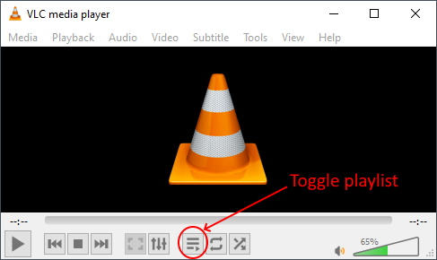

Then add media files by drag and dropping folders to the playlist window:

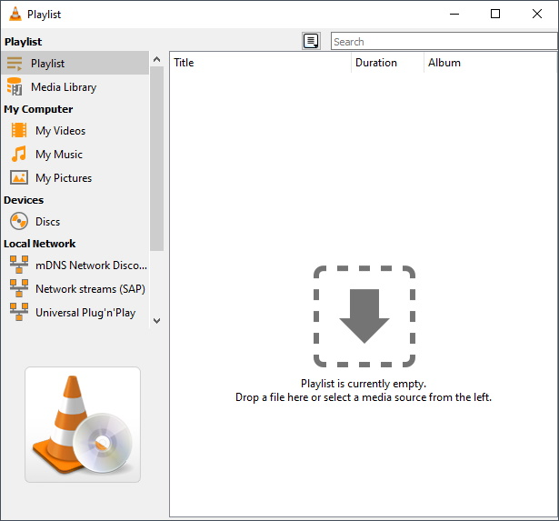

Finally, use the VLC option **Media** > **Save Playlist to File (Ctrl+Y)** in order to
save the playlist to a `.xspf`, `.m3u` or `.m3u8` file.

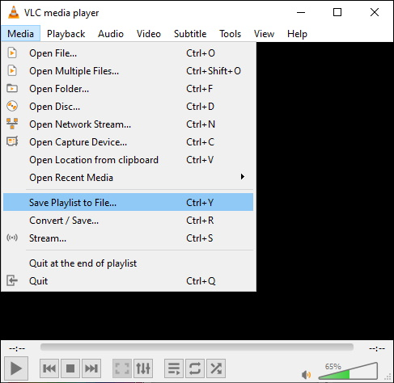

# First use

When you open **VLC Playlist Manager** for the first time, its window may seem a bit empty.
The first thing you need to do is to load a playlist (see previous chapter on how to create
a compatible playlist with VLC).

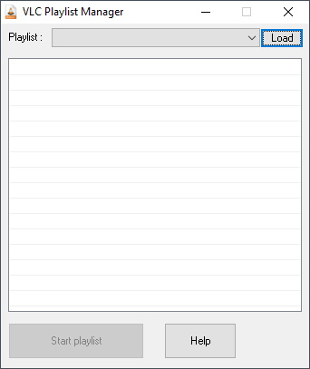

# Open a playlist

## from the program

Just click the "Load" button to browse and open a `.xspf`, `.m3u` or `.m3u8` playlist.

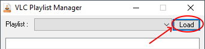

## by drag and dropping a playlist on the program window

Simply drag and drop a `.xspf`, `.m3u` or `.m3u8` playlist onto the window of 
**VLC Playlist Manager** in order to load this playlist.

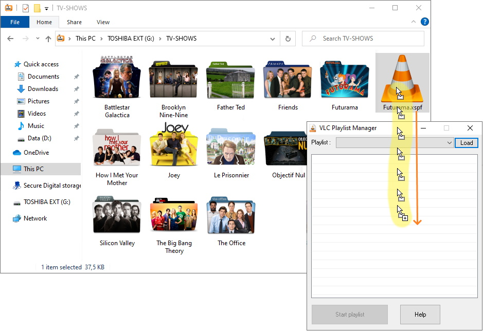

## by drag and dropping a playlist on the exe

In the Windows File Explorer, drag and drop a `.xspf`, `.m3u` or `.m3u8` playlist
onto the **VLC Playlist Manager** executable in order to open the program with this playlist.

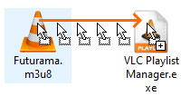

## in command line

Finally, you can launch **VLC Playlist Manager** with a playlist as argument:

```
"C:\path\to\VLC Playlist Manager.exe" G:\TV-SHOWS\Futurama.xspf
```

# Recent playlists

Once a `.xspf`, `.m3u` or `.m3u8` playlist has been opened in **VLC Playlist Manager**,
you will find it again in the quick-access dropdown list at the top of the program:

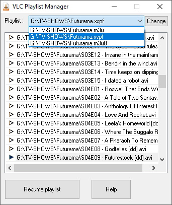

This allows you to easily switch between TV shows in case you are watching more than one.

# Force resume

When you load a new playlist, **VLC Playlist Manager** will launch VLC with the very first
episode of the list. Then after watching a few episodes, the already-watched episodes will be
shown with a white "play" icon, and the last episode to watch will have a black "play" icon.

You can decide to force-resume at any episode by double-clicking on a media file in the list:

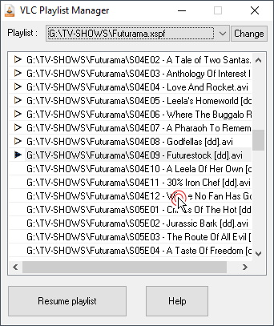

# VLC listener and notifications

Once **VLC Playlist Manager** starts or resumes a playlist, it will activate a small agent in
memory called the **VLC listener**, in order to keep track of the last episode being watched.

When **VLC listener** is active, it shows as a small "eye" notification at the bottom of the program:

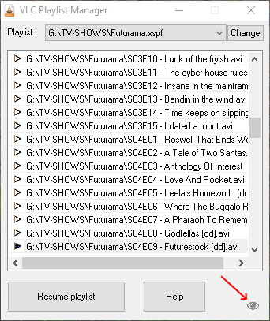

When the user closes VLC, the **VLC listener** agent detects it and closes itself as well.
To restart the agent, use the "Resume playlist" button or double-click on an episode.

**VLC Playlist Manager** needs to be kept open when you're watching your episodes.
Thanks to the **VLC listener** agent, it will check the last file played by VLC from the file
`%AppData%\vlc\vlc-qt-interface.ini`. This way, you don't have to do any manual operation:
just watch your episodes, and **VLC Playlist Manager**  will automatically bookmark the last
watched episode for you!

If for any reason the **VLC listener** agent is not able to access or read the VLC recent file
`%AppData%\vlc\vlc-qt-interface.ini` then it will show an error with this exclamation point icon:

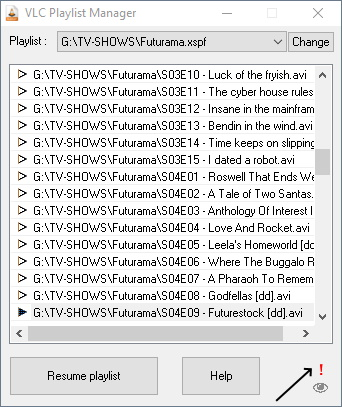

In this case, the save functionality of the last watched episode may not work properly.
You can either double-click the next episode for **VLC Playlist Manager** to save it manually,
or better yet drop an email to the author at [mougino@free.fr](mailto:mougino@free.fr) so he
might help find a fix.

# Source code

**VLC Playlist Manager** is free and open source software released under a GNU GPL v3 licence.
The licence can be found at https://www.gnu.org/licenses/gpl.txt
The code for the program can be found at https://github.com/mougino/VLC-Playlist-Manager/
